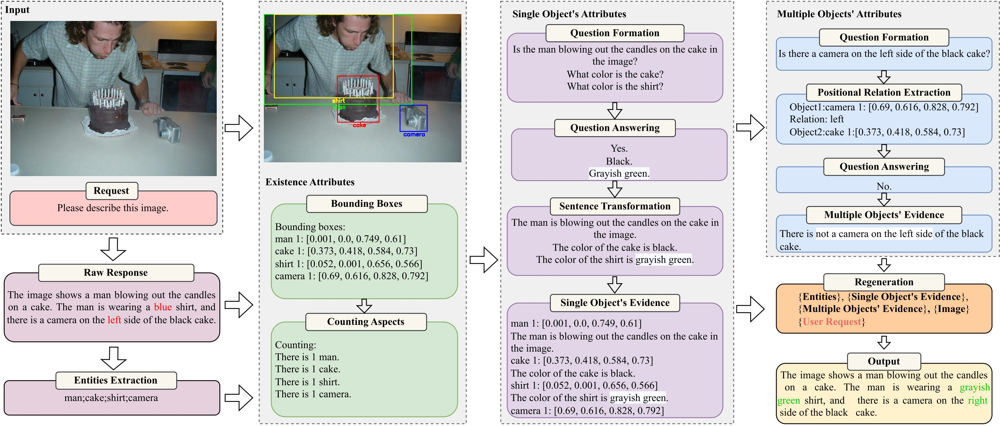
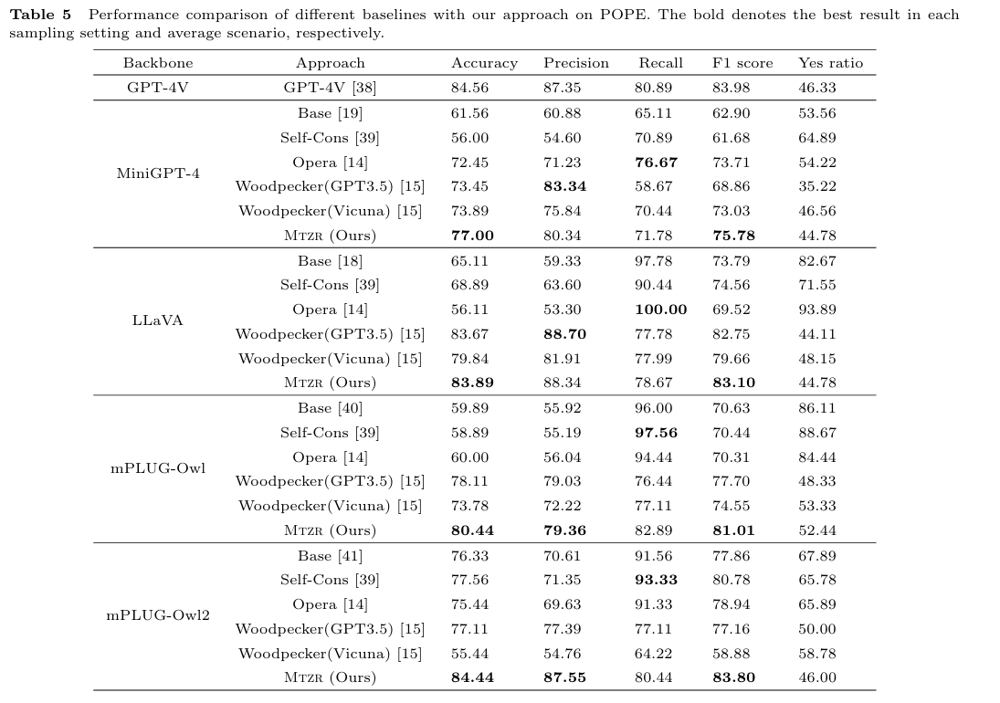
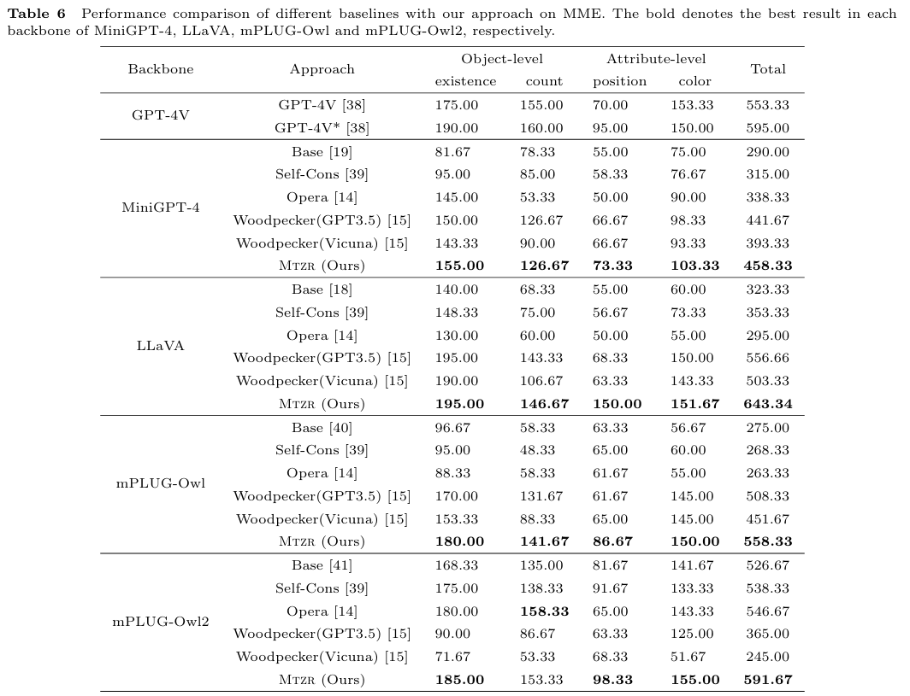

# Training-free and Zero-shot Regeneration for Hallucination Mitigation in MLLMs: Representation Understanding Perspective Training-free and Zero-shot Regeneration for Hallucination Mitigation
-----------------

<p align="center">
    
</p>

> Hallucinations in multimodal large language models (MLLMs) are urgent problems to be solved in the new era of artificial general intelligence (AGI). Compared with traditional large language models (LLMs), besides handling language understanding and modeling, we also need to consider the detection and position determination of objects in vision. Therefore, to tackle the hallucination issues, the existing studies attempt to employ few-shot learning on the following perspectives: 1) limit the length of the generated response, 2) iteratively generate multiple candidates or select from multiple candidates via beam search, 3) locally edit the possible parts of primary response, and 4) leverage external knowledge to augment the generation capability. To address the above potential weaknesses, this paper proposes a multimodal training-free and zero-shot regeneration approach by obatain various multimodal evidences and globally improving the raw response to alleviate hallucinations in MLLMs (Mtzr). Specifically, we first extract the entity-level evidences by object-based pre-trained models with in-context learning. Then, we mine the attribute-level evidences inside each entity and cross different entities with heterogeneous in-context learning based on both uni- and multimodal pre-trained models. Finally, towards the obtained multimodal evidences, we regenerate the response with augmented context by residually connecting both the input text and image. For better understanding, we provide theoretical explanations with universal approximation to support why our approach can bring about smaller hallucination. Detailed experimental results and extensive analysis demonstrate that our approach is very suitable for mitigating hallucination in MLLMs.

### 📍 POPE Result

This part focuses on object-level hallucinations.
<p align="center">
    
</p>

### 📍 MME Result

This part focuses on both object- and attribute-level hallucinations.
<p align="center">
    
</p>

## 🛠️ Preliminary

1. Create conda environment

```bash
conda create -n corrector python=3.10
conda activate corrector
pip install -r requirements.txt
```

2. Install required packages and models

- Install `spacy` and relevant model packages, following the instructions in [Link](https://github.com/explosion/spaCy). This is used for some text processing operations.

```bash
pip install -U spacy
python -m spacy download en_core_web_lg
python -m spacy download en_core_web_md
python -m spacy download en_core_web_sm
```
- For our **Open-set Detector**. Install GroundingDINO following the instructions in [Link](https://github.com/IDEA-Research/GroundingDINO).

## ⭐ Usage

**1. Inference**

To make corrections based on an image and a text output from MLLM, run the inference code as follows:

```Shell
for task in  mme_existence mme_count mme_position mme_color pope_adversarial pope_popular pope_random
do
for mode in entity_extract detecte question answer
do
    CUDA_VISIBLE_DEVICES=1 python all_claim_generate.py \
        --task $task \
        --model_name minigpt \
        --device 0 \
        --seed 13 \
        --method mtzr \
        --mode $mode \
        --rewrite
done
done

```
The output text will be printed in the terminal, and intermediate results saved by default as ```./intermediate_view.json```.

## 🌻 Acknowledgement
This repository benefits from [Woodpecker](https://github.com/BradyFU/Woodpecker), [mPLUG-Owl](https://github.com/X-PLUG/mPLUG-Owl), [GroundingDINO](https://github.com/IDEA-Research/GroundingDINO), [BLIP-2](https://huggingface.co/Salesforce/blip2-flan-t5-xxl), and [LLaMA-Adapter](https://github.com/OpenGVLab/LLaMA-Adapter). Thanks for their awesome works.
```
